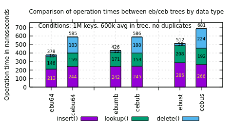
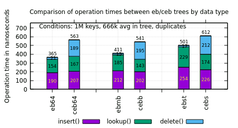
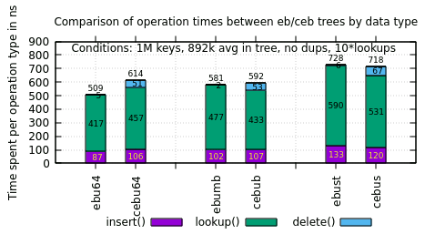
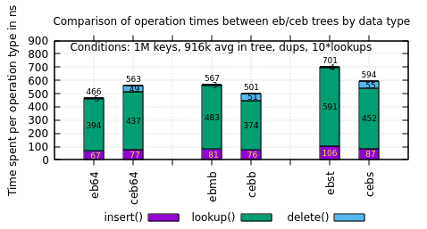
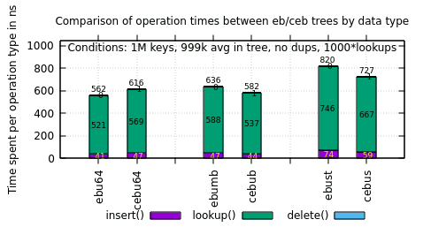
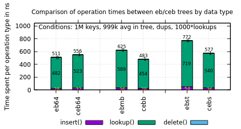

## 2025-05-01 - Performance comparison between EBTree and CEBTree

Tests were run on a single core of an Intel Core i7-6700K running at 4.4 GHz
equipped with dual-channel DDR4-2400, using the "bench" utility from the
"tests/" directory, comparing the performance of the two libraries at the
following commits:

- [ebtree](https://github.com/wtarreau/ebtree) [stable-6.0](https://github.com/wtarreau/ebtree/commits/stable-6.0) @[ccf9d9f](https://github.com/wtarreau/ebtree/commits/ccf9d9f) ("TESTS: bench: enable the unique-keys tests as well")
-  [cebtree](https://github.com/wtarreau/cebtree) [master](https://github.com/wtarreau/cebtree/commits/)  @[6b5cd28](https://github.com/wtarreau/cebtree/commits/6b5cd28) ("OPTIM: descent: stop at the node when the path to the leaf is not used")

The principle of the test consists in creating 1 million nodes, and randomly
picking one of them, if the node is not in the tree, then a random value is
assigned (of the type of the key) and the node is inserted, otherwise if it's
in the tree, it is either looked up or deleted. The distribution between
lookups and deletes is affected by a config parameter indicating how many
lookups are performed per delete, in order to simulate different use cases
where a certain number of lookups are performed before a node is removed.

The program reports statistics about operation rates and tree state. In
parallel, perf record is run at 4000 samples per second to measure the average
ratio of time spent in each function. After processing, the results below
indicate the average time spent in each function, in nanoseconds.

The raw results are stored in [/results/bench-eb-ceb/lk\*](/results/bench-eb-ceb/), where "*lk\** "
represents the average number of lookups performed per node, and where we find
the following files:

  - bench-ceb*.out: the output of "bench" on ceb trees
  - bench-eb*.out: the output of "bench" on eb trees
  - perf-ceb*.out: the filtered output of "perf report" on ceb trees
  - perf-eb*.out: the filtered output of "perf report" on eb trees
  - graph.gnup: the gnuplot script used to produce the graphs
  - meas.out: the whole test
  - meas-m.out: the tests involving multiple keys
  - meas-u.out: the tests involving unique keys
  - multi.png: graph of operations on trees supporting multiple identical keys
  - unique.png: graph of operations on trees only supporting unique keys

## Tests

### 1 average lookup between insert() and delete()

The first test is run with one single lookup between insert and delete. This is
convenient because it results in the following distribution of operations:

  - for trees storing unique keys:
    30% inserts, 30% deletes, 40% lookups.
    The tree stabilizes at 60% fill rate.

  - for trees storing duplicate keys:
    33.3% inserts, 33.3% deletes, 33.3% lookups.
    The tree stabilizes at 66.6% fill rate.

Thus it allows to roughly compare the individual cost of each operation under
load.

| unique keys | duplicates |
|-------------|------------|
|  |  |

What's seen on the graphs is that compact trees are much slower on deletion
since that's one area where ebtrees shine by being O(1). The slow down on
insertion and lookups is minimal (around 10% for integers), and for memory-
based keys (blocks, strings), both insertion and lookups are faster on compact
trees than on eb trees, probably thanks to the reduced memory bandwidth usage,
and a bit also for the O(1) duplicate handling while ebtrees are in O(logN),
which explains why the difference looks a bit more important with duplicates.

### 10 average lookups between insert() and delete()

The second test concerns keys that are looked up 10 times before being deleted.
This results in more keys in the tree since less operations are deletion (916k
keys for dups, 892k for unique).

| unique keys | duplicates |
|-------------|------------|
|  |  |

The insert and delete operations are much rarer so their amortized average time
is much lower. In addition the strong reduction on the number of writes seems
to improve the overall walk time through the trees, probably just due to better
data caching, since it's unlikely that branch prediction plays a role when
descending a tree.

### 1000 average lookups between insert() and delete()

In the final test, 1000 lookups are performed between insertion and removal.
The goal essentially is to illustrate how the trees behave on lookup-mostly
workloads. The tree is much more full, at 999k entries in both tests.
Insertions and deletions are pretty rare, roughly 1.5k per second each for 1.5M
operations.

| unique keys | duplicates |
|-------------|------------|
|  |  |

The 64-bit integer test still doesn't benefit from extra lookups, which is not
surprising since the lookup was already more expensive from the start due to
the necessity to consult both branches during the descent, hence delay the
operation by one extra memory lookup. However the gap between eb and ceb
continues to widen for memory storage like strings, where ceb now becomes 33%
faster with dups, and 12% faster with unique keys (which is more likely to be
used for multiple lookups).

## Preliminary conclusions

At first glance this at least confirms initial suspicions that these much more
compact trees will not be used for heavy changes due to the O(logN) deletion,
so schedulers are out of the equation. However often looked up information such
as config elements, GUID etc can make quite some sense since the storage size
is the same as for a list but with O(logN) lookups. More generally, the benefit
can appear when it comes to indexing any data that's never deleted (config
elements, logs etc). What was initially considered as not very likely was that
it would even be faster than ebtrees on strings or memory blocks. It's worth
noting that this has been made possible thanks to the tagging of leaf pointers,
as in the most generic design, keys have to be re-read at each layer to
determine if it's a node or a leaf, which is more expensive than ebtree or the
current cebtree which are a form of prefix trees (comparison at each layer
restarts from the previous layer).

## Future work

The performance gap on string lookups has widened since the last commit which
tries to stop as soon as the looked up key is found on any node. It is
interesting because it restarts a potential interest in minimizing the longest
length by trying to optionally balance the tree for lookup-mostly use cases,
and/or to reconsider the option to connect up to 4 branches per layer, that was
once envisioned for ebtrees, in order to cut the average length in half, at the
expense of storing 4 pointers in each node.
